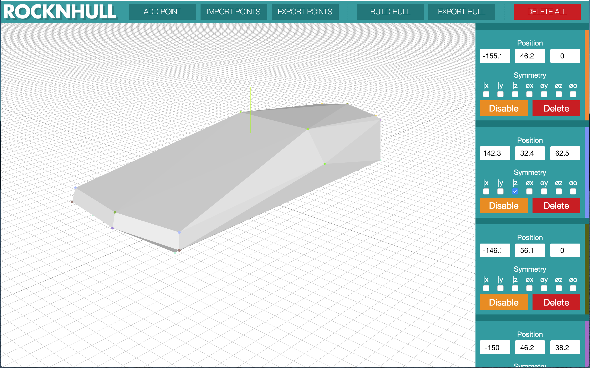

# ROCKNHULL
Make 3D convex hulls and rock-shaped things. [DEMO](http://me.jonathanlurie.fr/rocknhull/)

(you can download the file with all the points [here](./samples/car.csv), and the generated [OBJ mesh file](./samples/car.obj))

## Features
- Add as many 3D points as necessary
- Each point can come with its optional symmetrical selves (mirror and radial)
- Generate the convex hull from all the points and their symmetrical selves
- Export the list of points (and their symmetrical settings) as CSV to continue to work on it later
- Import a (previously exported) list of points. Since it's a simple CSV, those points can be generated by something else
- Export the convex hull as OBJ file

## Motivations
Originally, I just wanted to have something to create futuristic low-poly vehicles to import into a simple web-based game. After spending some time looking for a builder (and not finding any), I thought it would be fun to actually make it myself!

## Under the hood
- ThreeJS for all the 3D stuff
- Svelte for the frontend framework

# License
MIT
